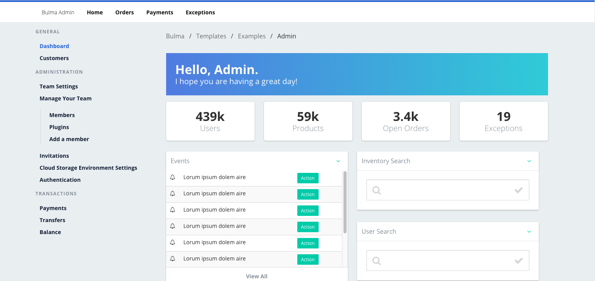
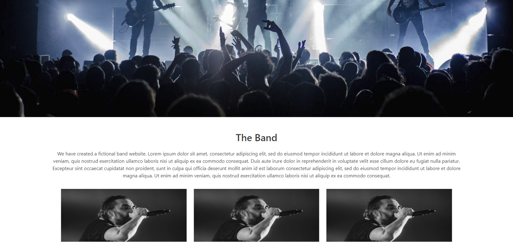
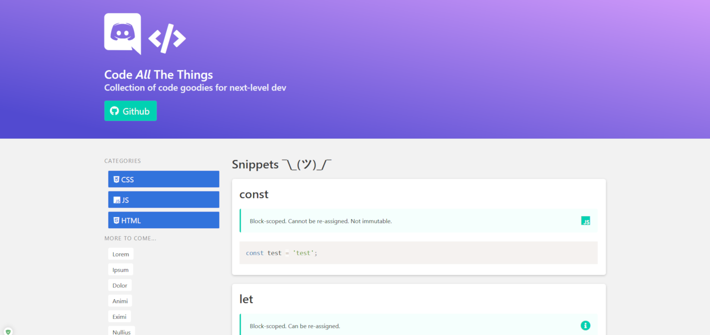
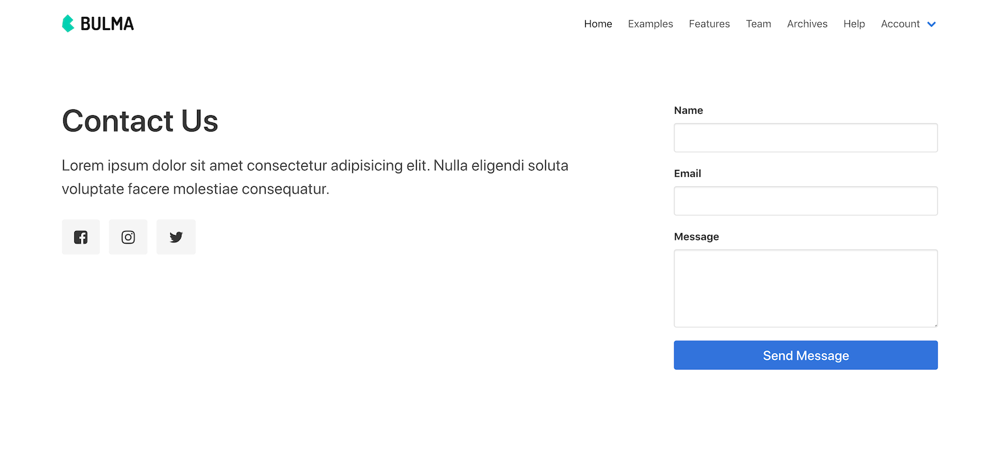
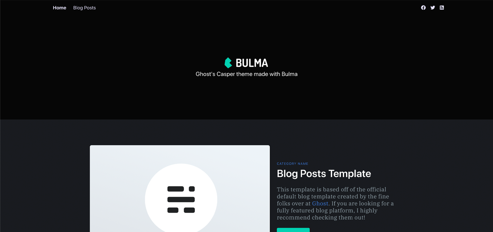
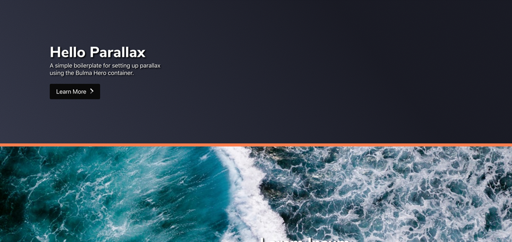

# Bulma Templates
Free Templates for the Bulma CSS Framework 

## Versions
  The original bulma templates were made with version 0.1.1 and can be found in the **0.1.1** branch. The newest templates are made with version 0.9.0 and can be found in the **master** branch.

## Templates

The templates are located in the `/templates` directory

#### `1` Absurd 2

#### `2` Admin

#### `3` Band

#### `4` Blog

#### `4` Blog 2

#### `5` Bulma

#### `6` Cards

#### `7` Cheatsheet

#### `8` Contact

#### `9` Cover

#### `10` Documentation

#### `11` Fav Icon

#### `12` Favicon

#### `13` First Post

#### `14` Forum

#### `15` Ghost Blog

#### `16` Hello Parallax

#### `17` Hero

#### `18` Inbox

#### `19` Instaalbum

#### `20` Kanban

#### `21` Kanban2

#### `22` Landing

#### `23` Modal Cards

#### `24` Neumorphic Login

#### `25` Personal

#### `26` Register

#### `27` Showcase

#### `28` Tabs

## Licence

Code released under [the MIT license](https://github.com/bulmatemplates/bulma-templates/blob/master/LICENSE).

## Resource 

These templates came from https://bulmatemplates.github.io/bulma-templates/
